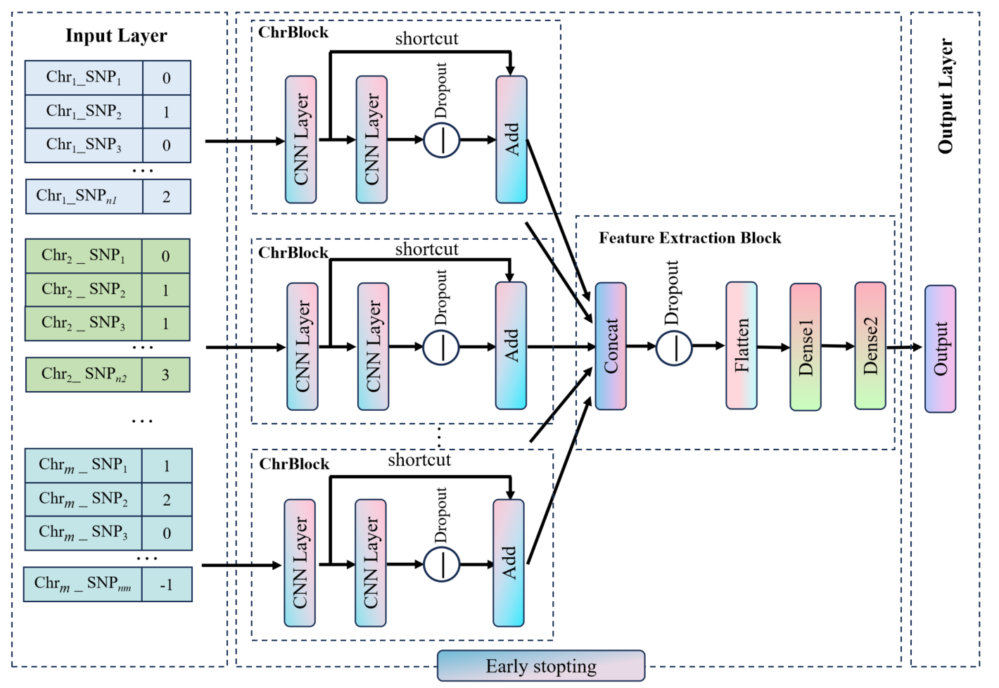

# ChrCNN

ChrCNN, A Chromosomal CNN Framework with Multi-Trait Output for Genomic Selection in Plants
and Animals Breeding.
Citation:
<!-- PROJECT SHIELDS -->

[![Contributors][contributors-shield]][contributors-url]
[![Forks][forks-shield]][forks-url]
[![Stargazers][stars-shield]][stars-url]
[![Issues][issues-shield]][issues-url]
[![MIT License][license-shield]][license-url]
[![LinkedIn][linkedin-shield]][linkedin-url]

<!-- PROJECT LOGO -->
<br />

<p align="center">
  <a href="https://github.com/dzw893246344/ChrCNN/">
    
  </a>
  <p align="center">
    Download project address:
    <a href="https://github.com/dzw893246344/ChrCNN/issues">https://github.com/dzw893246344/ChrCNN/issues</a>
  </p>

</p>

 
## Contents

- [Overview of the ChrCNN project](#over-view-of-the-chrcnn-project)
  - [Pre-development configuration requirements](#pre-development-configuration-requirements)
  - [Installation steps](#installation-steps)
- [File directory structure](#file-directory-structure)
- [Demo of a ten-fold cross-validation](#demo-of-a-ten-fold-cross-validation)
- [Contributors](#contributors)
  - [How to get involved in open source projects](#how-to-get-involved-in-open-source-projects)
- [Version Control](#version-control)
- [Author](#author)
- [Email](#email)

### Over view of the ChrCNN project

ChrCNN is a genome-wide prediction model based on deep learning theory, 
which aims to predict plant and animal phenotypes using genome-wide markers. 
This model mainly uses Python 3.8.10 and TensorFlow 2.10.0 writes. The model structure
of ChrCNN is as follows:



###### Pre-development configuration requirements

1. Python 3.8.10
2. R 3.6.3(optional)

###### Installation steps

1. Clone the repo

```sh
git clone https://github.com/shaojintian/Best_README_template.git
```

2. ChrCNN environment setup
To run ChrCNN, you first need to set up the operating environment:
Install Miniconda (https://docs.conda.io/en/latest/miniconda.html) first and add it to the system environment. (Miniconda can be checked when installing it, which is required to use the GUI.)

  Then you use the following command to build the running environment:
```sh
conda create -n ChrCNN python=3.8.10
conda activate ChrCNN
cd ChrCNN
conda install --yes --file requirements.txt
conda install -c nvidia cuda-nvcc
```

If you need to compare the performance of ChrCNN with the R language models (rrBLUP, GBLUP, and BMORS), use the following command to install R:
```sh
conda install -c conda-forge r-base=4.1.3
R
```
And then you use the following command in Rstudio to install the R packages:
```sh
imported_packages <- read.csv("installed_packages.csv")
for (package_name in imported_packages$Package) {
  install.packages(package_name)
}
q()
y
```
### File directory structure
```
filetree 
├── LICENSE.txt
├── README.md
├── /data/
│  ├── {species}_Chr_index.txt
│  ├── {species}_genotypes.txt
│  ├── {species}_phenotypes.txt
│  ├── {species}_subgenotypes.txt
│  ├── {species}_subphenotypes.txt
│  └── data.ipynb
├── /models/
│  ├── BayesCpi.R
│  ├── BMORS.R
│  ├── CNN.py
│  ├── GBLUP.R
│  ├── R_model_train.py
│  └── rrBLUP.R
├── /results/
│  ├── /fc0/
│  │  └── /species/
│  │      └── {species}_{trait_select}_{model}.csv
│  └── /fc1/
│     └── {species}_{model}_prediction.csv
├── main.py
├── command_circle.py
├── my_dataset.py
├── requirements.txt
└── installed_packages.csv
```
The file mainly contains the following five parts:
(1)requirements.txt / installed_packages.csv
  For environment construction, environment configuration required packages and their versions.
(2)data
  In this directory are sample files for input data from different species. Among them, the genotype files are genotype matrix encoded by 012, the phenotype files are phenotypic values of multi trait, and the chr_index files are the starting indexes of SNP on each chromosome of the genotype file. The subgenotype files and the subphenotype files are subsets of genotype files and phenotype files. Chr_index files, subgenotype files and subphenotype files were generated from data.ipynb. 
(3)models
  In this directory are R scripts and python scripts for model building.
(4)results
  In this directory are the results of model training and prediction.
(5)my_dataset.py
  This script is used to do some pre-processing of the data and to build the dataset.
(6)main.py
  This script is used to run the whole program of model training, testing or prediction.
(7)command_circle.py
  This script is used to run all the experiments in the paper by calling 'main.py'.

### Demo of a ten-fold cross-validation 
```sh
python main.py --fc 0 --md ChrCNN --gt data/rice_genotypes.txt --pt data/rice_phenotypes.txt -ci data/rice_Chr_index.txt --ts all --cr 4 --od results/fc0/rice --o rice_all_ChrCNN
```
--fc 0 means cross-validation
--md ChrCNN uses the ChrCNN model
--gt data/rice_genotypes.txt reads the genotype file
--pt data/rice_phenotypes.txt reads the phenotype file
-ci data/rice_Chr_index.txt reads the Chr_index file
--ts all selects all the traits
--cr 4 sets the rate of Chromosome of ChrCNN (generally equal to the number of traits)
--od results/fc0/rice outputs the results to the directory results/fc0/rice
--o rice_all_ChrCNN names prefix names the prefix of the results

For more parameters and details see main.py

### Contributors

Please read **CONTRIBUTING.md** to find out which developers contributed to this project.

#### How to get involved in open source projects

Contributing makes the open source community a great place to learn, inspire and create. Any contribution you make is **very much appreciated**!


1. Fork the Project
2. Create your Feature Branch (`git checkout -b feature/AmazingFeature`)
3. Commit your Changes (`git commit -m 'Add some AmazingFeature'`)
4. Push to the Branch (`git push origin feature/AmazingFeature`)
5. Open a Pull Request


### Version Control

The project uses Git for versioning. You can see the currently available versions in the repository.

### Author
Zewang Deng
### Email
ww180331@163.com


### Copyright Notice

This project is licensed under the HUTB License, more details are in [LICENSE.txt] [LICENSE.txt](https://github.com/shaojintian/Best_README_template/blob/master/LICENSE.txt)


